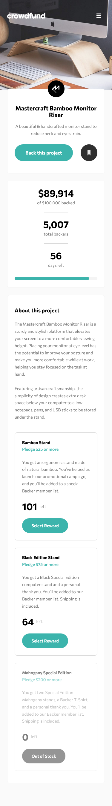
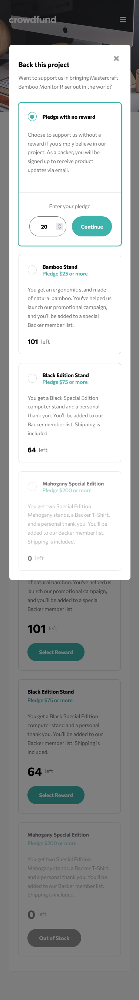
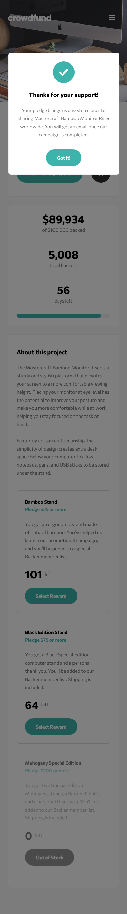
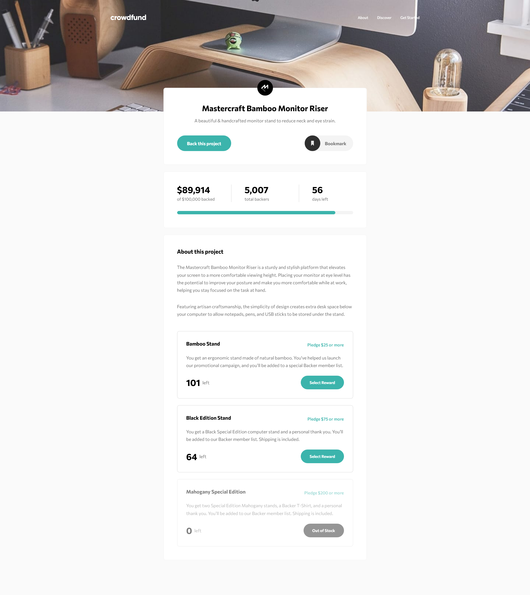
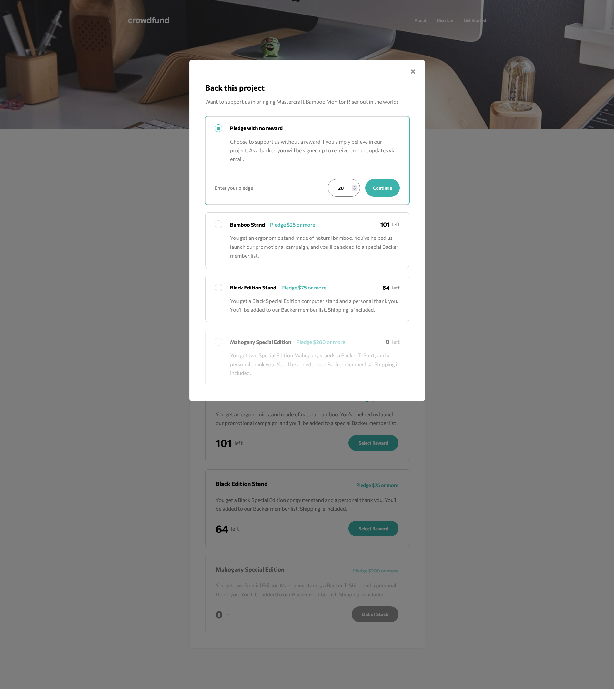
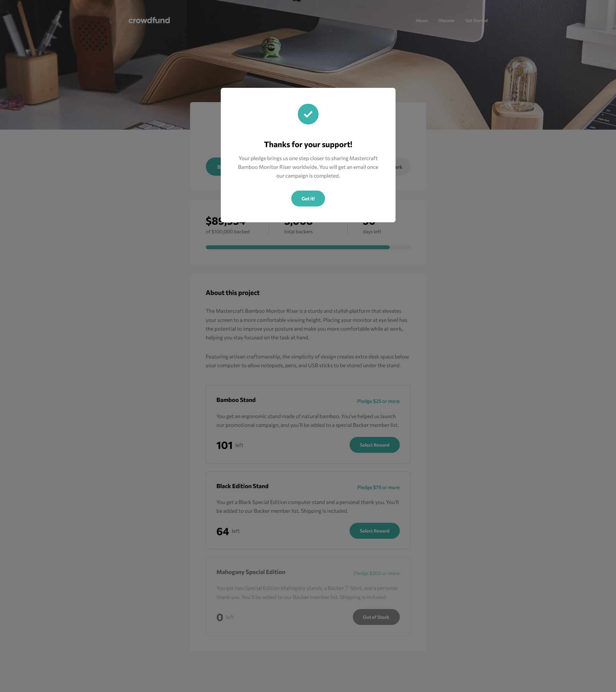

# Frontend Mentor - Crowdfunding product page solution

This is a solution to the [Crowdfunding product page challenge on Frontend Mentor](https://www.frontendmentor.io/challenges/crowdfunding-product-page-7uvcZe7ZR). Frontend Mentor challenges help you improve your coding skills by building realistic projects.

## Links

- Solution URL: [Frontend Mentor Solution Page](https://www.frontendmentor.io/solutions/crowdfunding-product-page-H-drPZFRJ3)
- Live Site URL: [GitHub Pages Site](https://karolbanat.github.io/crowdfunding-product-page/)

## Author

- Frontend Mentor - [@karolbanat](https://www.frontendmentor.io/profile/karolbanat)

## Screenshot

